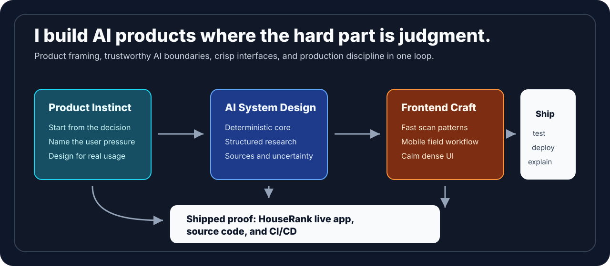
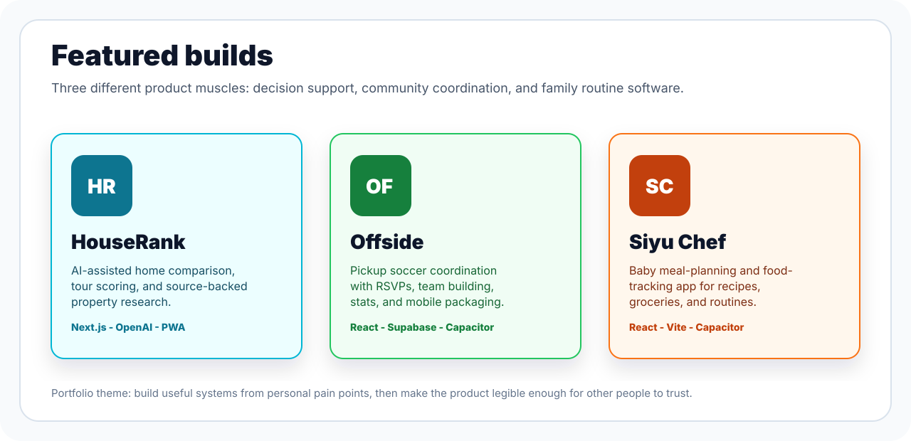

<!-- GitHub profile README -->

# Rishabh Kumar

**Product-minded software engineer building AI systems that turn messy decisions into clear, useful software.**

I like problems where the inputs are incomplete, the tradeoffs are real, and the interface has to earn a user's trust. I work across product framing, AI boundaries, decision logic, frontend craft, and the reliability details that turn a clever demo into a usable product.

## What To Notice First

| Signal | Why it matters |
| --- | --- |
| **Product taste** | I do not just wrap AI around a form. I start with a painful decision, then design the workflow around how people actually think and act. |
| **AI judgment** | I separate deterministic logic from model-driven research, show sources and confidence, and treat uncertainty as part of the product. |
| **Shipping range** | I can move from idea to interface, API contract, safety boundary, test suite, deployment, docs, and public launch. |

## Featured Builds

| Project | What it proves | Links |
| --- | --- | --- |
| **HouseRank** | AI decision-support product with deterministic scoring, source-backed GPT research, privacy boundaries, CI, docs, and production deployment. | [Live](https://housebuyer-app.vercel.app) · [Source](https://github.com/RishabhKumar124/houserank) · [Brief](https://github.com/RishabhKumar124/houserank/blob/main/docs/RECRUITER_BRIEF.md) |
| **Offside** | Mobile-first sports coordination app for pickup soccer RSVPs, team building, stats, and community loops. | [Live](https://offside-beta.vercel.app) · [Source](https://github.com/RishabhKumar124/offside) |
| **Siyu Chef** | Consumer app for baby meal planning, feeding history, groceries, and family routines. | [Source](https://github.com/RishabhKumar124/siyu-chef) |

## Flagship Deep Dive

HouseRank is a local-first home buying workspace that helps buyers compare properties after discovery, when spreadsheets, memory, and listing tabs stop being enough.

| Product layer | What I built |
| --- | --- |
| **Decision engine** | Transparent scoring across affordability, property fit, commute, profile priorities, and 20 structured tour observations. |
| **AI research** | Source-backed OpenAI Responses API analysis with structured outputs, confidence, assumptions, risk-adjusted investment scoring, and five-year scenarios. |
| **Trust boundaries** | Server-only secrets, citation allowlisting, `store: false`, fair-housing guardrails, explicit uncertainty, and deterministic behavior when AI is unavailable. |
| **Product experience** | Mobile-first PWA, background analysis, saved and visited workflows, local persistence, portable backups, and responsive field use. |
| **Engineering quality** | Strict TypeScript, accessibility linting, contract tests, production builds, zero known npm audit findings, CI, Dependabot, and documented tradeoffs. |

**[Try HouseRank](https://housebuyer-app.vercel.app)** | **[Read the source](https://github.com/RishabhKumar124/houserank)** | **[Architecture](https://github.com/RishabhKumar124/houserank/blob/main/docs/ARCHITECTURE.md)** | **[Engineering decisions](https://github.com/RishabhKumar124/houserank/blob/main/docs/ENGINEERING_DECISIONS.md)**

## Fast Case Study

| Question | Answer |
| --- | --- |
| **Who is it for?** | Buyers comparing serious home candidates after discovery, especially when the decision mixes finance, lifestyle, commute, schools, visit impressions, and resale risk. |
| **What is novel?** | It treats home buying as a decision-support problem, not just search. The app keeps deterministic scoring, tour observations, and source-backed GPT research separate but comparable. |
| **What would I discuss in an interview?** | How I designed the scoring model, why the AI boundary exists, how I handled fair-housing risk, and what would change for multi-user production scale. |
| **What proves care?** | Live deployment, screenshots, PWA behavior, CI, tests, security notes, architecture docs, release, and an honest limitations section. |

## How I Build

- **Start with the decision, not the model.** AI earns a place only where it adds judgment or research that deterministic software cannot provide cleanly.
- **Design for uncertainty.** Sources, confidence, assumptions, missing evidence, and failure states are product features.
- **Own the full path.** I move from product idea to data model, API contract, interaction design, responsive QA, deployment, and documentation.
- **Keep the interface calm.** Dense workflows should feel fast and legible, especially on the small screen someone is actually holding in the moment.
- **Make tradeoffs visible.** Architecture notes explain what I chose, what I rejected, and what would change at production scale.

## Tools I Reach For

## Beyond The Flagship

I also use small, fast projects to explore sports interfaces, interactive storytelling, animation, and event experiences. The common thread is the same: take an idea seriously enough to make it tangible, testable, and pleasant to use.

I am open to software and product engineering roles where strong implementation, product judgment, and practical AI thinking belong in the same person.
